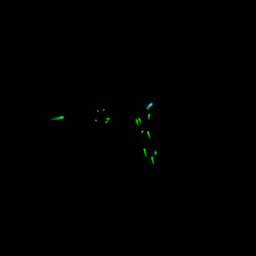
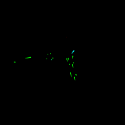
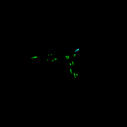
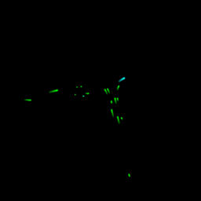
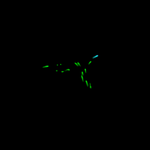
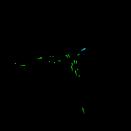
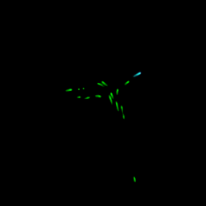
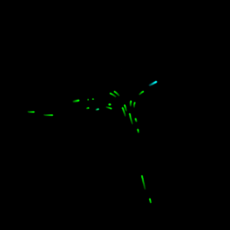
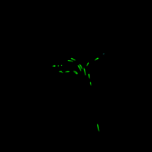
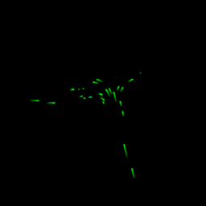

# Generative AI for Trajectory Prediction

This project is currently in progress.

This repository provides code for training a model that predicts vehicle trajectories. The model takes as input an image representing the previous one-second trajectory and generates an output image depicting the predicted trajectories for the next second in the traffic scenario. The model can also predict further seconds ahead, receiving as input its output.

Follow the steps below to set up and run the training process.

For more details, visit the [project page](https://giovannilucente.github.io/generative_AI_trajectory_predictor/index.html). 

This project is conducted in collaboration with other colleagues from DLR.

## Installation and Setup

To install and run this project locally, follow these steps:

### 1. Clone the repository
First, clone the repository to your local machine:
```bash
git clone https://github.com/giovannilucente/generative_AI_trajectory_predictor.git
cd generative_AI_trajectory_predictor
```

### 2. Install the requirements
Install all the required dependencies listed in the requirements.txt:
```bash
pip install -r requirements.txt
```

### 3. Download the DLR UT dataset
Navigate to the /trajectories folder and download the DLR UT trajectory dataset (in .csv format) from the [official site](https://zenodo.org/records/14773161):
```bash
cd trajectories
# Download here the trajectory dataset in .csv format
cd ..
```
Note: ensure that you download the dataset into the /trajectories folder.

### 4. Convert the dataset
Once the dataset is downloaded, use the provided Python script to convert the raw DLR UT dataset into images that can be used for training. Run the following command, if you are interested in occupancy prediction:
```bash
python3 rasterize_data.py
```
The images that will be used for training will be generated in the folder /output_images_cv2.
The frames will be green lines (representing vehicles trajectories for one second) in a black background. This allows to learn an occupancy prediction. If the scope is trajectory prediction, then is necessary to distinguish between different vehicles. Trajectories must be represented then with different colors. To generate a datset suitable for trajectory prediction run:
```bash
python3 rasterize_tracking_data.py
```
The images that will be used for training the proper trajectory prediction will be generated in the folder /output_tracking_images_cv2.

### 5. Launch the training
To train the model for occupancy prediction run the following command:
```bash
python3 train_prediction_image_space_multistep.py --steps 3 --prediction occupancy --loss balanced_weighted_l1 --batch 32 --epochs 200
```
To train the model for trajectory prediction run:
```bash
python3 train_prediction_image_space_multistep.py --steps 3 --prediction trajectories --loss balanced_weighted_l1 --batch 32 --epochs 200
```
There is the possibility to change the loss function (loss_functions.py contains the possible losses), the number of step in the future used for training, the batch size or number of epochs.
The model will train and the best-performing model will be saved in the folder:
```bash
/output/{name of the model}_{name of the loss function}.
```
Generated images of the validation dataset can be seen in the folder:
```bash
/output/validation_plots_{name of the model}_{name of the loss function}. 
```
In case of trajectory prediction, the initial folder is called /output_tracking.

### 6. Testing
To test the occupancy prediction model run:
```bash
python3 occupancy_prediction.py --model_path 'output/unet_multistep_balanced_weighted_l1_loss/best_model.pth' --datset_directory 'output_images_cv2'
```
modify the arguments to input the model to test and a directory where is located the dataset to test. The dataset must be already composed by images and not table data.

## Example of Predicted and Ground Truth images

Below is an example of the predicted frame and ground truth, in terms of occupancy prediction.

<p align="center">
  
  
</p>
<p align="center">
  
  
</p>
<p align="center">
  
  
</p>
<p align="center">
  
  
</p>
<p align="center">
  
  
</p>
